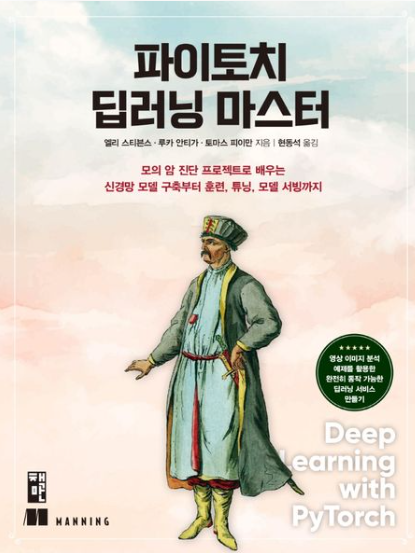

# KDT(Korea Digital Training)- Deep Learning

교재 : 파이토치 딥러닝 마스터

- 엘리 스티븐스, 루카 안티가, 현동석(책만)  
   [교재 사이트](https://product.kyobobook.co.kr/detail/S000061353646)  
   [교재 소스 코드](https://github.com/deep-learning-with-pytorch/dlwpt-code)
    

    

      그 외의 관련 사이트
    

  [딥러닝 관련 카탈로그](https://www.manning.com/catalog#section-83)
  [교재 Github](https://github.com/onlybooks/pytorch)
  

#### 개발환경

| 패키지 이름 | 버전                        |
| ----------- | --------------------------- |
| Python      | 3.8.18                      |
| sys.version | [MSC v.1916 64 bit (AMD64)] |
| torch       | 2.2.0                       |
| pandas      | 2.0.3                       |
| matplotlib  | 3.7.2                       |
| sns         | 0.12.2                      |
| np          | 1.24.3                      |
| sklearn     | 1.3.0                       |

   
   
|날짜(Date) | 제목 | 네이버 블로그 | 관련 디렉토리 |
| --------  | ---  | -----------| ------------|
| 23.03.12  | PYTORCH개발환경설정, TENSORFLOW, cuda <->cpu 변환| [Naver Blog](https://blog.naver.com/mathnoah/223380692140)| DAY01/class/tensor_basic.ipynb  |
| 23.03.12  |텐서(Tensor) 기본 연산| [Naver Blog](https://blog.naver.com/mathnoah/223380894984)| DAY01/class/tensor_basic.ipynb  |
| 23.03.12  |Tensor Shape(형태 변환, 형변환, 차원 추가/제거) | [Naver Blog](https://blog.naver.com/mathnoah/223381016264)| DAY01/class/tensor_shape.ipynb |
| 23.03.12  |Tensor concat, Tensor 차원/형태 변경| [Naver Blog](https://blog.naver.com/mathnoah/223381063931)| DAY01/ |
| 23.03.13  | 딥러닝 개요| [Naver Blog](https://blog.naver.com/mathnoah/223382007319)| DAY02/ex_or_perceptron.ipynb |
| 23.03.13  |선형회귀, torch.nn.functional | [Naver Blog](https://blog.naver.com/mathnoah/223382134810)| DAY02/ex_linearRegression.ipynb |
| 23.03.13  |선형회귀, 이진분류, 다중분류, SoftMax함수, OneHotEncoding| [Naver Blog](https://blog.naver.com/mathnoah/223383139478)| DAY03/Mini_test/24_03_14_미니테스트.ipynb |
| 23.03.13  |딥러닝 : 클래스 모델 구현, MNIST FASHION 이미지 분석 코드, 학습 스케줄러, 모델 저장 & 로딩, 모델 모드, 모델 파라미터, 손실/비용함수| [Naver Blog](https://blog.naver.com/mathnoah/223383596058)| DAY03/homework.ipynb |
| 23.03.14  | | [Naver Blog]()| DAY04/ |

  

    목차
  

  \
  1장 딥러닝과 파이토치 라이브러리 소개
__1.1 딥러닝 혁명
__1.2 딥러닝을 위한 파이토치
__1.3 왜 파이토치인가?
____1.3.1 딥러닝 경쟁 구도
__1.4 파이토치 딥러닝 프로젝트 둘러보기
__1.5 하드웨어와 소프트웨어 요구사항
____1.5.1 주피터 노트북
__1.6 연습 문제
__1.7 핵심 요약

2장 사전 훈련된 신경망
**2.1 이미지를 인식하는 사전 훈련된 신경망
\_\_**2.1.1 이미지 인식을 위해 사전 훈련된 신경망 가져오기
\_**\_2.1.2 알렉스넷
\_\_**2.1.3 레즈넷
\_**\_2.1.4 준비, 시...작 전에 잠깐만
\_\_**2.1.5 실행!
\_**\_2.2 가짜 이미지를 만드는 사전 훈련된 모델
\_\_**2.2.1 GAN 게임
\_**\_2.2.2 사이클GAN
\_\_**2.2.3 말을 얼룩말로 바꾸는 신경망
**2.3 장면을 설명하는 사전 훈련된 신경망
\_\_**2.3.1 뉴럴토크2
**2.4 토치 허브
**2.5 결론
**2.6 연습 문제
**2.7 핵심 요약

3장 텐서 구조체
**3.1 부동소수점 수의 세계
**3.2 텐서: 다차원 배열
\_**\_3.2.1 파이썬 리스트에서 파이토치 텐서로
\_\_**3.2.2 첫 텐서 만들어보기
\_**\_3.2.3 텐서의 핵심
**3.3 텐서 인덱싱
**3.4 이름이 있는 텐서
**3.5 텐서 요소 타입
\_**\_3.5.1 dtype으로 숫자 타입 지정하기
\_\_**3.5.2 모든 경우에 사용하는 dtype
\_**\_3.5.3 텐서의 dtype 속성 관리
**3.6 텐서 API
**3.7 텐서를 저장소 관점에서 머릿속에 그려보기
\_\_**3.7.1 저장 공간 인덱싱
\_**\_3.7.2 저장된 값을 수정하기: 텐서 내부 연산
**3.8 텐서 메타데이터: 사이즈, 오프셋, 스트라이드
\_**\_3.8.1 다른 텐서의 저장 공간에 대한 뷰 만들기
\_\_**3.8.2 복사 없이 텐서 전치하기
\_**\_3.8.3 더 높은 차원에서의 전치 연산
\_\_**3.8.4 인접한 텐서
**3.9 텐서를 GPU로 옮기기
\_\_**3.9.1 텐서 디바이스 속성 관리
**3.10 넘파이 호환
**3.11 일반화된 텐서도 텐서다
**3.12 텐서 직렬화
\_\_**3.12.1 h5py로 HDF5 병렬화하기
**3.13 결론
**3.14 연습 문제
\_\_3.15 핵심 요약

4장 실제 데이터를 텐서로 표현해보기
**4.1 이미지 다루기
\_\_**4.1.1 컬러 채널 더하기
\_**\_4.1.2 이미지 파일 로딩
\_\_**4.1.3 레이아웃 변경하기
\_**\_4.1.4 데이터 정규화
**4.2 3차원 이미지: 용적 데이터
\_**\_4.2.1 특수 포맷 로딩
**4.3 테이블 데이터 표현하기
\_**\_4.3.1 실세계 데이터셋 사용하기
\_\_**4.3.2 와인 데이터를 텐서로 읽어오기
\_**\_4.3.3 점수 표현하기
\_\_**4.3.4 원핫 인코딩
\_**\_4.3.5 언제 카테고리화 할 것인가
\_\_**4.3.6 임계값으로 찾기
**4.4 시계열 데이터 다루기
\_\_**4.4.1 시간 차원 더하기
\_**\_4.4.2 시간 단위로 데이터 만들기
\_\_**4.4.3 훈련 준비
**4.5 텍스트 표현하기
\_\_**4.5.1 텍스트를 숫자로 변환하기
\_**\_4.5.2 문자 원핫 인코딩
\_\_**4.5.3 모든 단어를 원핫 인코딩하기
\_**\_4.5.4 텍스트 임베딩
\_\_**4.5.5 청사진으로서의 텍스트 임베딩
**4.6 결론
**4.7 연습 문제
\_\_4.8 핵심 요약

5장 학습 기법
**5.1 시대를 초월하는 모델링 학습
**5.2 학습은 파라미터 추정에 불과하다
\_**\_5.2.1 온도 문제
\_\_**5.2.2 데이터 수집
\_**\_5.2.3 데이터 시각화
\_\_**5.2.4 먼저 선형 모델을 골라 시도해보기
**5.3 손실을 줄이기 위한 방안
\_\_**5.3.1 파이토치로 문제 풀어보기
**5.4 경사를 따라 내려가기
\_\_**5.4.1 손실 줄이기
\_**\_5.4.2 분석
\_\_**5.4.3 모델 적합을 위한 반복
\_**\_5.4.4 입력 정규화
\_\_**5.4.5 (다시 해보는) 시각화
**5.5 파이토치의 자동미분: 모든 것을 역전파하라
\_\_**5.5.1 기울기 자동 계산
\_**\_5.5.2 골라쓰는 옵티마이저
\_\_**5.5.3 훈련, 검증, 과적합
\_**\_5.5.4 자동미분의 주의사항과 자동미분 끄기
**5.6 결론
**5.7 연습 문제
**5.8 핵심 요약

6장 신경망을 활용한 데이터 적합
**6.1 인공 뉴런
\_\_**6.1.1 다중 계층 신경망 합성하기
\_**\_6.1.2 오차 함수
\_\_**6.1.3 우리에게 필요한 건 활성 함수
\_**\_6.1.4 그 밖의 활성 함수
\_\_**6.1.5 최적의 활성 함수 고르기
\_**\_6.1.6 신경망에서 학습의 의미
**6.2 파이토치 nn 모듈
\_**\_6.2.1 forward 대신 **call** 사용하기
\_\_**6.2.2 다시 선형 모델로
**6.3 드디어 신경망
\_\_**6.3.1 선형 모델 대체하기
\_**\_6.3.2 파라미터 살펴보기
\_\_**6.3.3 선형 모델과 비교하기
**6.4 결론
**6.5 연습 문제
\_\_6.6 핵심 요약

7장 새와 비행기 구별하기: 이미지 학습
**7.1 작은 이미지를 모아 놓은 데이터셋
\_\_**7.1.1 CIFAR-10 다운로드
\_**\_7.1.2 데이터셋 클래스
\_\_**7.1.3 데이터 변환
\_**\_7.1.4 데이터 정규화
**7.2 새와 비행기를 구별하기
\_**\_7.2.1 데이터셋 구축
\_\_**7.2.2 완전 연결 모델
\_**\_7.2.3 분류기의 출력
\_\_**7.2.4 출력을 확률로 표현하기
\_**\_7.2.5 분류를 위한 손실값
\_\_**7.2.6 분류기 훈련
\_**\_7.2.7 완전 연결의 한계
**7.3 결론
**7.4 연습 문제
**7.5 핵심 요약

8장 컨볼루션을 활용한 일반화
**8.1 컨볼루션
\_\_**8.1.1 컨볼루션의 역할
**8.2 컨볼루션 사용해보기
\_\_**8.2.1 경계 패딩하기
\_**\_8.2.2 컨볼루션으로 피처 찾아내기
\_\_**8.2.3 깊이와 풀링으로 한 단계 더 인식하기
\_**\_8.2.4 우리의 신경망에 적용하기
**8.3 nn.Module 서브클래싱하기
\_**\_8.3.1 nn.Module로 정의된 우리의 신경망
\_\_**8.3.2 파이토치가 파라미터와 서브모듈을 유지하는 방법
\_**\_8.3.3 함수형 API
**8.4 우리가 만든 컨볼루션 신경망 훈련시키기
\_**\_8.4.1 정확도 측정
\_\_**8.4.2 모델을 저장하고 불러오기
\_**\_8.4.3 GPU에서 훈련시키기
**8.5 모델 설계
\_**\_8.5.1 메모리 용량 늘리기: 너비
\_\_**8.5.2 모델이 수렴하고 일반화하도록 돕는 방법: 정규화
\_**\_8.5.3 더 복잡한 구조를 배우기 위해 깊이 파헤치기: 깊이
\_\_**8.5.4 모델의 성능 비교
\_**\_8.5.5 이미 오래된 방식
**8.6 결론
**8.7 연습 문제
**8.8 핵심 요약

[2부] 실전 이미지 학습: 폐암 조기 진단

9장 암과 싸워 이기기 위한 파이토치 활용
**9.1 사용 사례 소개
**9.2 대규모 프로젝트 준비
**9.3 CT 스캔이란
**9.4 프로젝트: 엔드투엔드 폐암 진단기
\_**\_9.4.1 신경망이 동작할 때까지 데이터를 던져넣을 수 없는 이유
\_\_**9.4.2 결절이란 무엇인가
\_**\_9.4.3 데이터 소스: LUNA 그랜드 챌린지
\_\_**9.4.4 LUNA 데이터 다운로드
**9.5 결론
**9.6 핵심 요약

10장 여러 데이터 소스를 통합 데이터셋으로 합치기
**10.1 원본 CT 데이터 파일
**10.2 LUNA 애노테이션 데이터 파싱
\_**\_10.2.1 훈련셋과 검증셋
\_\_**10.2.2 애노테이션 데이터와 후보 데이터 합치기
**10.3 개별 CT 스캔 로딩
\_\_**10.3.1 하운스필드 단위
**10.4 환자 좌표계를 사용해 결절 위치 정하기
\_\_**10.4.1 환자 좌표계
\_**\_10.4.2 CT 스캔 형태와 복셀 크기
\_\_**10.4.3 밀리미터를 복셀 주소로 변환하기
\_**\_10.4.4 CT 스캔에서 결절 추출하기
**10.5 간단한 데이터셋 구현
\_**\_10.5.1 getCtRawCandidate 함수로 후보 배열 캐싱하기
\_\_**10.5.2 LunaDataset.**init**으로 데이터셋 만들기
\_**\_10.5.3 훈련/검증 분리
\_\_**10.5.4 데이터 렌더링
**10.6 결론
**10.7 연습 문제
\_\_10.8 핵심 요약

11장 종양 탐지를 위한 분류 모델 훈련
**11.1 기본 모델과 훈련 루프
**11.2 애플리케이션의 메인 진입점
**11.3 사전 훈련 설정과 초기화
\_\_**11.3.1 모델과 옵티마이저 초기화
\_**\_11.3.2 데이터 로더의 관리와 데이터 공급
**11.4 첫 번째 경로 신경망 설계
\_**\_11.4.1 핵심 컨볼루션
\_\_**11.4.2 전체 모델
**11.5 모델 훈련과 검증
\_\_**11.5.1 computeBatchLoss 함수
\_**\_11.5.2 훈련 때와 유사한 검증 루프
**11.6 성능 메트릭 출력
\_**\_11.6.1 logMetrics 함수
**11.7 훈련 스크립트 실행
\_**\_11.7.1 훈련에 필요한 데이터
\_\_**11.7.2 막간을 활용해 enumerateWithEstimate 함수 알아보기
**11.8 모델 평가: 정확도 99.7%라면 잘 끝난 것일까?
**11.9 텐서보드로 훈련 관련 메트릭을 그려보기
\_**\_11.9.1 텐서보드 실행
\_\_**11.9.2 메트릭 로깅 함수가 텐서보드를 지원하도록 만들기
**11.10 모델이 결절 탐지를 학습하지 못하는 이유
**11.11 결론
**11.12 연습 문제
**11.13 핵심 요약

12장 메트릭과 증강을 활용한 훈련 개선
**12.1 개선을 위한 상위 계획
**12.2 착한 개와 나쁜 녀석: 거짓 양성과 거짓 음성
**12.3 긍정과 부정의 경우를 도식화하기
\_\_**12.3.1 아무나 보고 짖는 록시의 장점은 재현율
\_**\_12.3.2 잠은 많아도 도둑은 잘 잡는 프레스톤의 특기는 정밀도
\_\_**12.3.3 logMetrics으로 정밀도와 재현율 구하기
\_**\_12.3.4 궁극의 메트릭: F1 점수
\_\_**12.3.5 새 메트릭으로 모델이 잘 동작하는지 확인하기
**12.4 이상적인 데이터셋의 모습
\_\_**12.4.1 데이터를 실제보다 ‘이상’에 가깝게 만들기
\_**\_12.4.2 균형잡힌 LunaDataset으로 훈련시킨 결과의 차이
\_\_**12.4.3 과적합 증상 알아채기
**12.5 과적합 문제 다시 살펴보기
\_\_**12.5.1 과적합된 얼굴-나이 예측 모델
**12.6 데이터 증강으로 과적합 방지하기
\_\_**12.6.1 특별 데이터 증강 기술
\_**\_12.6.2 데이터 증강 효과 확인하기
**12.7 결론
**12.8 연습 문제
**12.9 핵심 요약

13장 세그멘테이션을 활용한 의심 결절 탐색
**13.1 프로젝트에 두 번째 모델 추가하기
**13.2 다양한 세그멘테이션 유형
**13.3 시맨틱 세그멘테이션: 픽셀 단위 분류
\_\_**13.3.1 유넷 아키텍처
**13.4 세그멘테이션을 위한 모델 업데이트
\_\_**13.4.1 기성품 모델을 프로젝트에 적용하기
**13.5 세그멘테이션을 위한 데이터셋 업데이트
\_\_**13.5.1 매우 제한된 입력 크기를 갖는 유넷
\_**\_13.5.2 2차원 vs 3차원 데이터의 유넷 사용시 장단점
\_\_**13.5.3 실측 데이터 만들기
\_**\_13.5.4 Luna2dSegmentationDataset 구현
\_\_**13.5.5 훈련 데이터와 검증 데이터 설계
\_**\_13.5.6 TrainingLuna2dSegmentationDataset 구현
\_\_**13.5.7 GPU에서 돌리는 증강
**13.6 세그멘테이션을 위한 훈련 스크립트 업데이트
\_\_**13.6.1 세그멘테이션과 증강 모델 초기화
\_**\_13.6.2 아담 옵티마이저 사용하기
\_\_**13.6.3 다이스 손실
\_**\_13.6.4 이미지를 텐서보드에 넣기
\_\_**13.6.5 메트릭 로깅 업데이트
\_**\_13.6.6 모델 저장
**13.7 결과
**13.8 결론
**13.9 연습 문제
\_\_13.10 핵심 요약

14장 엔드투엔드 결절 분석, 그리고 남겨진 과제
**14.1 결승선을 향하여
**14.2 검증셋 독립
**14.3 CT 세그멘테이션과 결절 후보 분류 연결
\_\_**14.3.1 세그멘테이션
\_**\_14.3.2 복셀을 그룹화하여 결절 후보로 만들기
\_\_**14.3.3 결절을 찾았나? 거짓 양성을 줄이기 위한 분류
**14.4 정량적인 검증
**14.5 악성 예측
\_**\_14.5.1 악성 정보 습득
\_\_**14.5.2 AUC 베이스라인: 직경으로 분류하기
\_**\_14.5.3 이전 가중치의 재활용: 미세 튜닝
\_\_**14.5.4 텐서보드에서의 더 많은 출력
**14.6 진단을 통해 보게되는 것
\_\_**14.6.1 훈련셋, 검증셋, 테스트셋
**14.7 다음 단계는? 더 많은 데이터와 영감이 필요하다
\_\_**14.7.1 과적합 방지: 더 나은 정규화
\_**\_14.7.2 정제된 훈련 데이터
\_\_**14.7.3 결과 비교와 리서치 논문
**14.8 결론
\_\_**14.8.1 커튼 뒤에서
**14.9 연습 문제
**14.10 핵심 요약

[3부] 드디어, 배포

15장 제품으로 배포하기
**15.1 파이토치 모델 서빙
\_\_**15.1.1 플라스크에 들어간 모델
\_**\_15.1.2 배포 시 바라는 점
\_\_**15.1.3 배치 요청
**15.2 모델 내보내기
\_\_**15.2.1 ONNX로 파이토치를 넘어서는 호환성 확보
\_**\_15.2.2 파이토치로 내보내기: 추적
\_\_**15.2.3 추적된 모델로 만든 서버
**15.3 파이토치 JIT 동작
\_\_**15.3.1 전통적인 파이썬/파이토치를 넘어서기
\_**\_15.3.2 인터페이스와 백엔드 관점에서의 파이토치
\_\_**15.3.3 토치스크립트
\_**\_15.3.4 추적 가능하도록 토치스크립트로 만들기
**15.4 LibTorch: C++ 파이토치
\_**\_15.4.1 JIT로 처리된 모델을 C++로 실행하기
\_\_**15.4.2 시작부터 C++: C++ API
**15.5 모바일
\_\_**15.5.1 효율성 개선: 모델 설계와 양자화
**15.6 최근 기술: 파이토치 모델 엔터프라이즈 서빙
**15.7 결론
**15.8 연습 문제
**15.9 핵심 요약

